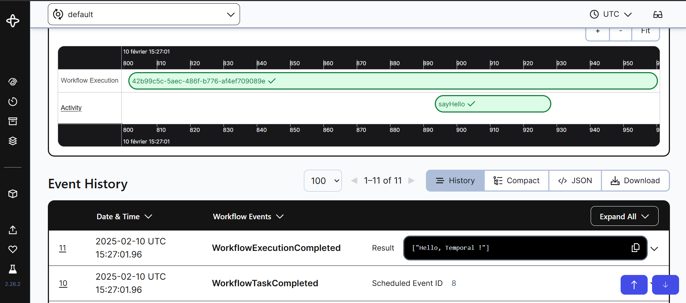

# Examples

## Hello World

### 🚀 Installation

:warning: Requires Docker for Temporal containerization

```sh
docker compose up -d

npm install
# or
yarn install

npm run dev
# or
npm run build
npm run start
```

This should open several ports:

-   Temporal Dashboard UI [http://localhost:8082](http://localhost:8082/namespaces/default/workflows)
-   An Express API [localhost:3000](localhost:3000)
    -   This API has an endpoint [localhost:3000/tasks/helloWorld](localhost:3000/tasks/helloWorld) where you can test POST requests.

You can test this endpoint using the following command:

```sh
curl --location 'localhost:3000/tasks/helloWorld' --header 'Content-Type: application/json' --data '{"name": "Temporal"}'
```

You can then visit the Temporal Dashboard UI to view your activity.

---

## 📷 Hello World Workflow on Temporal Dashboard


